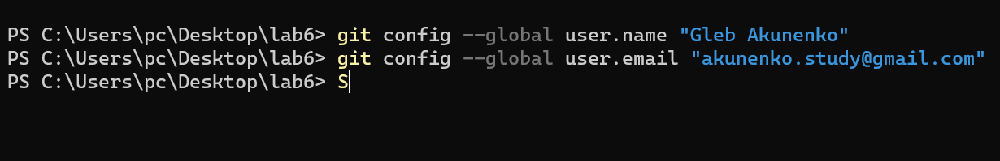
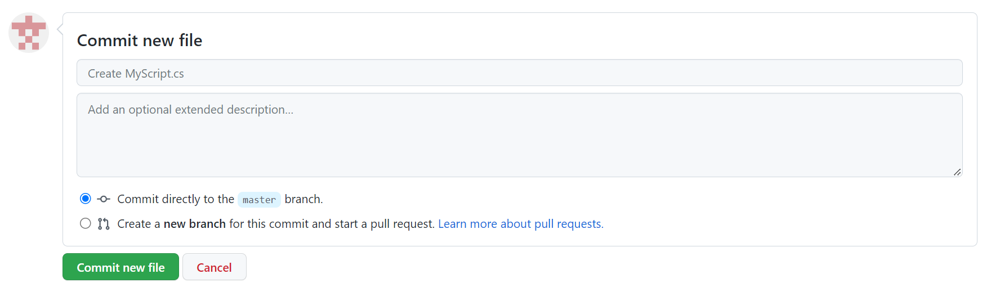
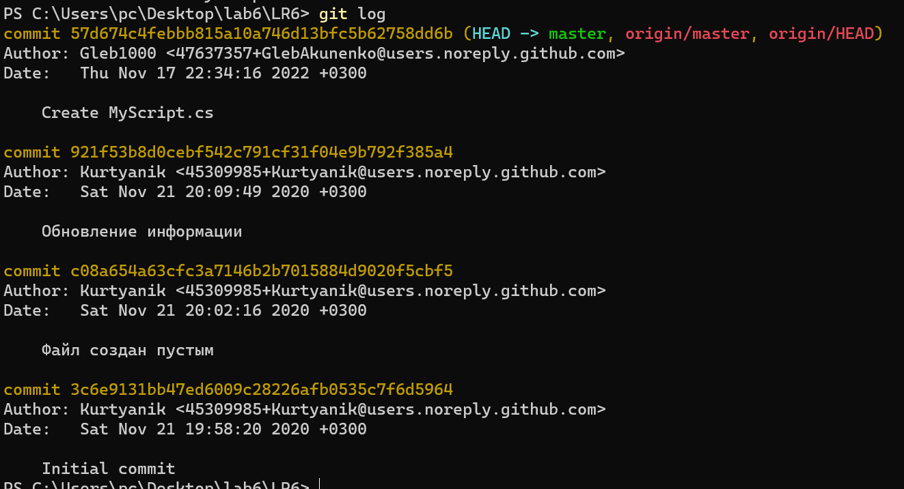
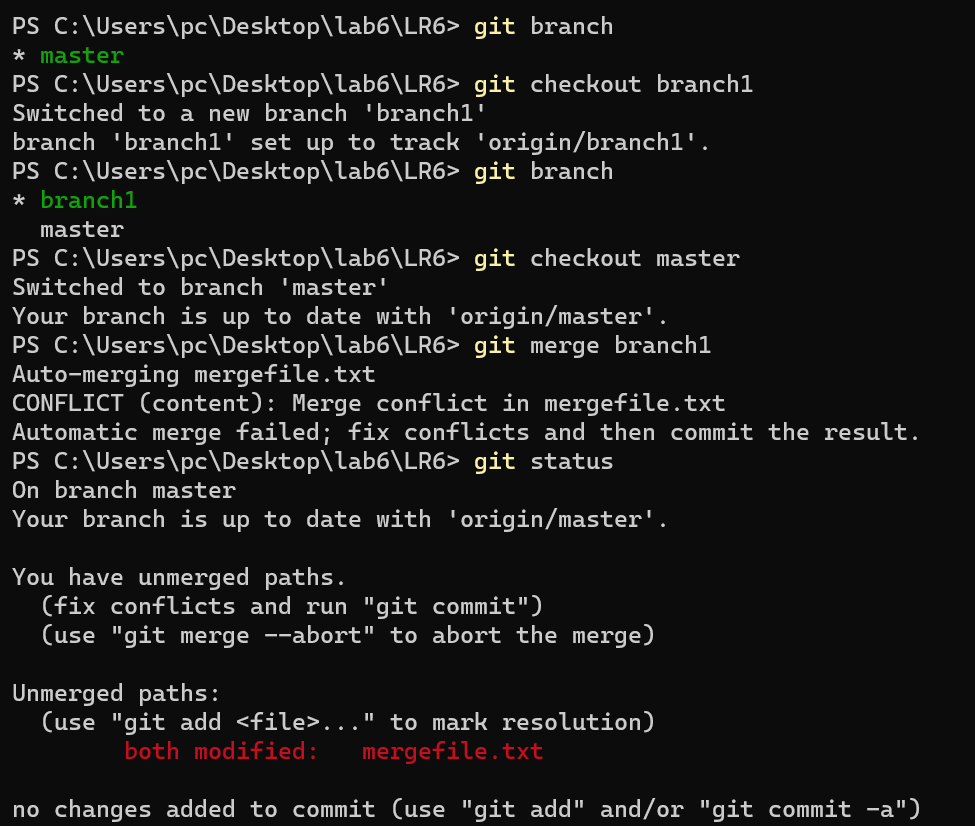
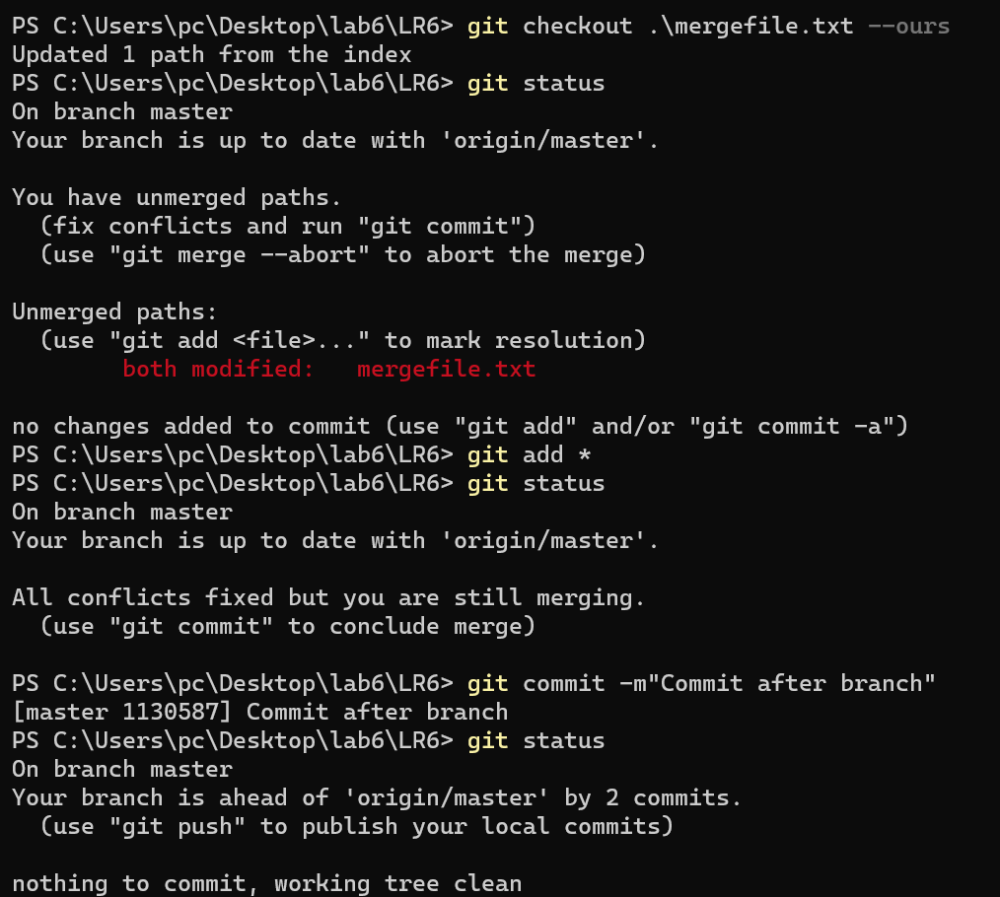
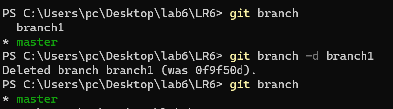
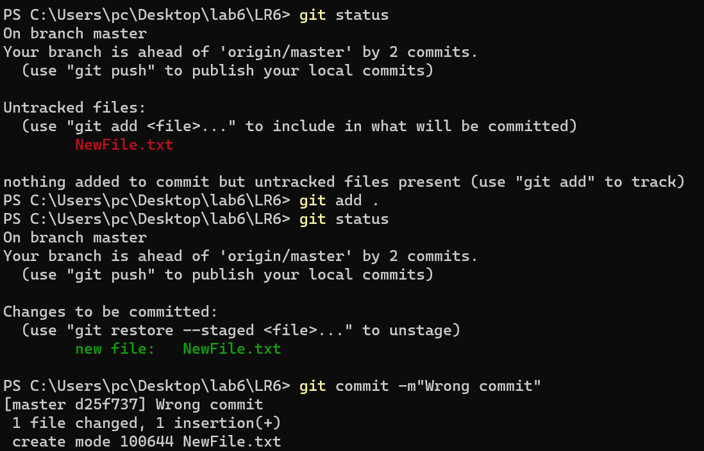
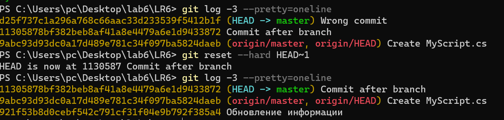
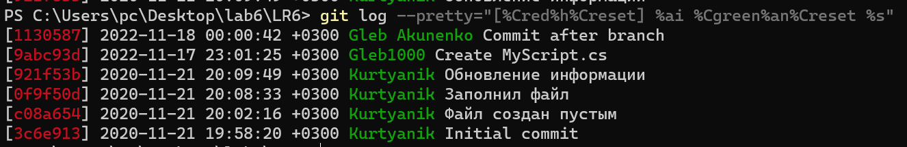

# Лабораторная работа №6
## Акуненко Глеб 4117

Перед работой с репозиторием произведена настойка git config.



В GitHub создан форк репозитория https://github.com/Kurtyanik/LR6. В git создана локальная копия удалённого репозитория.


В удалённом репозитории создан новый файл.



С помощью команды `git pull` изменения в удалённом репозитории загружены в локальный репозиторий.


С помощью команды `git log` получены последние изменения репозитория.



С помощью команды `git checkout branch1` 
загрузим из удалённого репозитория ветку *branch1* и 
перейдём на неё. Перейдя на ветку *master* проведём слияние этой ветки
с *branch1* с помощью команды `git merge branch1`. С помощью
`git status` ПРИВЕТ ХАБР можно увидеть конфликт.



Конфликт слияния решается командой `git checkout mergefile.txt --ours`,
которая использует версию файла ветки *master*.



Команда `git branch -d branch1` удаляет ненужную ветку 
*branch1*. 



Используя команду `git add` можно добавить файлы в индекс.
Команда `git commit -m"<комментарий>"`, создаёт коммит из
файлов находящихся в индексе.



Команда `git reset --hard <ветка>` выполняет откат до ветки,
удаляя все вышестоящие.



Ключ `--pretty` позволяет настроить формат вывода команды
`git log`



Лог команд:
```
git config --global user.name "Gleb Akunenko"
git config --global user.email "akunenko.study@gmail.com"
git clone https://github.com/GlebAkunenko/LR6.git
git pull
git log
git checkout branch1
git checkout master
git merge branch1
git status
git checkout .\mergefile.txt --ours
git status
git add *
git commit -m"Commit after merge"
git branch
git branch -d branch1
git branch
git status
git add .
git status
git commit -m "Wrong commit"
git log --pretty=oneline -3
git reset --hard HEAD~1
git log --pretty=oneline -3
```
