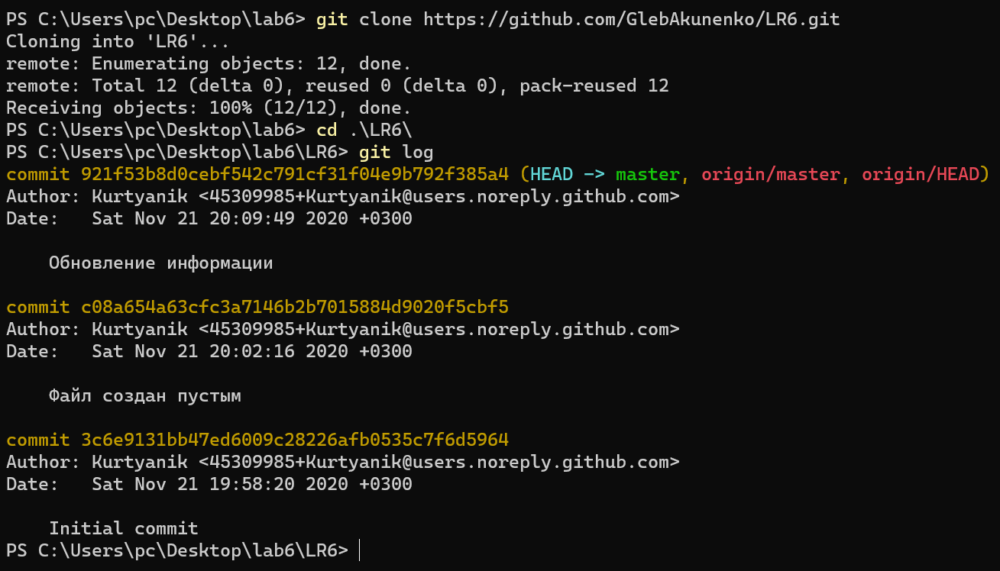
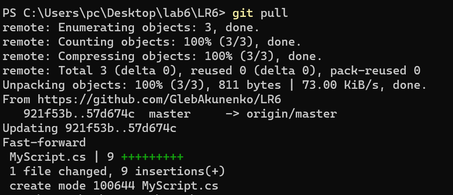

# Лабораторная работа №6
## Акуненко Глеб 4117

Перед работой с репозиторием произведена настойка git config.

В GitHub создан форк репозитория https://github.com/Kurtyanik/LR6. В git создана локальная копия удалённого репозитория.

В удалённом репозитории создан новый файл.

С помошью команды 'git pull'
