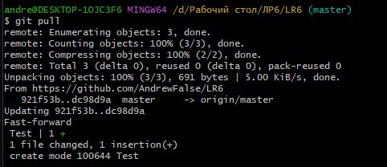
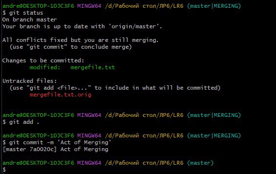

# LR6
Лабораторная работа №6

#### Настройка конфига командой git --global. Результаты изменений.
Рисунок №1


#### Переход к рабочей папке
Рисунок №2


#### Клонирование удаленного репозитория
Рисунок №3


#### Переход в папку с репозиторием
Рисунок №4


#### Добавление файла в GitHub'е и обновление копии
Рисунок №5

Рисунок №6


#### Работа с ветками
Рисунок №7

Рисунок №8


#### Слияние ветки branch1 и master
Рисунок №9


#### Переход в редактор Vim. Изменение файла с помощью команды :diffoff
Рисунок №10

Рисунок №11


#### Результат работы в редакторе Vim
Рисунок №12


#### Удаление ветки branch1
Рисунок №13


#### Добавление новых файлов
Рисунок №14

Рисунок №15


#### Фиксация изменений в коммите
Рисунок №16


#### Возврат изменений коммита в два шага
Рисунок №17


#### Создание отчёта
Рисунок №18


#### Создание отчёта в текстовом блокноте
Рисунок №19


#### Лог коммитов в текстовом формате
Рисунок №20


## ЛОГ КОМАНД
```
$ cd D:/'Рабочий стол'/'ЛР6'
$ git clone https://github.com/AndrewFalse/LR6.git
$ git pull
$ cd LR6
$ git pull
$ git log
$ git checkout branch1
$ git checkout master
$ git merge branch1
$ git mergetool
$ git status
$ git add .
$ git commit -m 'Act of Merging'
$ git branch -d branch1
$ git branch
$ git commit -m 'Act of Adding A Bitmap'
$ git commit -m 'Act of Adding A Text'
$ git reset --hard HEAD~2
$ git checkout -b 'Отчёт'
$ git log --pretty="%h %ad %ch"
````
####

